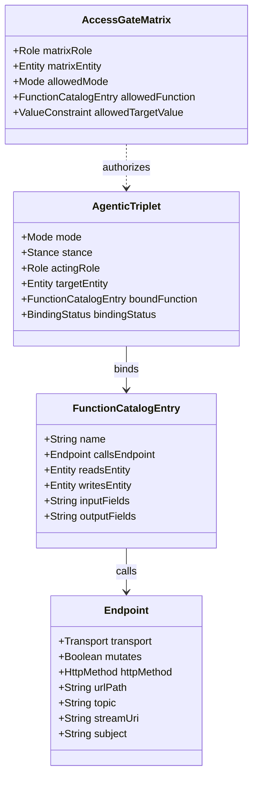

# DIS 1.8 — Proposed Specification & Review

**Status:** Draft Proposal  
**Baseline:** DIS 1.7.0 (`vocabulary/v1.7.0/dis.ttl`, `shapes/v1.7.0/dis-shapes.ttl`)  
**Trigger:** Dogfooding `argus.camera.v1` in [`2026-10-05-argus-automation-engine.md`](file:///Users/nate/docs/reports/2026-10-05-argus-automation-engine.md)  
**Author:** Nathan Walker  
**Date:** 2026-10-05  

---

## 1. Executive Summary & Review of DIS 1.7

### 1.1 What DIS 1.7 Accomplished
DIS 1.7 shifted Domain Intelligence Schema from a permissive documentation schema into an **enforceable structural grammar**:
1. **The Systems Layer (`Application`, `Endpoint`, `FunctionCatalogEntry`)**: Grounded agent triplets into real systems, requiring declared endpoints and explicit `dis:mutates` booleans rather than guessing safety from HTTP verbs.
2. **Enforceable Grammar Matrices (`EntityModeMatrix`, `AccessGateMatrix`)**: Turned permissions and denials into static SHACL-SPARQL constraints (`TripletWithinEntityModeShape`, `TripletWithinAccessGateShape`).
3. **`UtterancePolicy`**: Separated what an agent may **DO** from what it may **SAY**, with structural enforcement and bound values.
4. **`EntityInstance`**: Replaced unconstrained strings with closed, addressable populations (`spokenForm`, `systemKey`, `confusableWith`).
5. **Contract Consolidation**: Deprecated `.schema.json` in favor of Turtle/SHACL as the primary graph contract, with CUE as upstream source.

### 1.2 The Trial: `argus.camera.v1`
Attempting to transcribe the Argus camera warden automation engine ([`argus-camera.ttl`](file:///Users/nate/docs/reports/argus-camera-dis/argus-camera.ttl)) revealed that while the 1.7 grammar successfully caught critical architectural oversights (e.g., automated wardens attempting to seize lifecycle authority from human operators, alerts lacking typed entities), it exposed **six structural flaws (G1–G6)** in DIS 1.7 itself.

The core promise of DIS is **verifiable executable provenance** ("safety isn't inferred from conventions"). In 1.7, that promise broke down at the boundary between grammar modes, endpoint side-effects, and non-HTTP protocols.

---

## 2. DIS 1.7 Grammar Flaws & Root-Cause Analysis

| ID | Flaw | Observed Impact in `argus.camera.v1` | Root Cause in 1.7 | DIS 1.8 Resolution |
|---|---|---|---|---|
| **G1** | **Mode / Mutates Disconnect** | `t-observe` (`READ`) bound to `fn-set-enabled` (`mutates true`) validated cleanly. | `AgenticTripletShape` checks `dis:boundFunction` class but never inspects `callsEndpoint/mutates`. | SHACL-SPARQL consistency rule: `READ` requires `mutates false`; `CREATE`, `UPDATE`, `DELETE` require `mutates true`. |
| **G2** | **Target Blindness on Mutation** | `FunctionCatalogEntry` only had `readsEntity`. `fn-set-enabled` had to declare `readsEntity camera-recording` to express a write. | No property exists to state which entity an endpoint's mutation alters. | Introduce `dis:writesEntity` (required when `mutates true`). Enforce that triplet `targetEntity == writesEntity`. |
| **G3** | **Unbound Mutating Triplets** | `t-probe` (`CREATE`) bound no function and conformed without warning. | `boundFunction` is entirely optional on all triplets. | Require `boundFunction` for all mutating triplets, or require explicit `dis:bindingStatus dis:UNBOUND` with justification. |
| **G4** | **HTTP-Only Transport Trap** | MQTT and RTSP endpoints cannot be modeled. HA REST wrapper was forced as a hack; Frigate LAN HTTP violated `^https://`. | `Endpoint` mandates `httpMethod` and `urlPath`; `Application.baseUrl` mandates `^https://`. | Introduce `dis:transport` (`HTTP`, `MQTT`, `RTSP`, `NATS`, `GRPC`), transport-specific addressing, and `dis:networkScope`. |
| **G5** | **Coarse Mode Gates vs Asymmetric Rights** | "May disable, may not re-enable" could not be stated; one `UPDATE` gate permitted both. | Gates only match on `(Role, Entity, Mode)`. Asymmetry was relegated to runtime JMESPath `gateCondition`. | Add function-scoped gates (`dis:allowedFunction`) and value constraints (`dis:allowedTargetValue` / `dis:allowedTransition`). |
| **G6** | **Vocabulary Loading Trap in Conformance** | Running `pyshacl -s shapes.ttl -e dis.ttl dossier.ttl` rejected valid dossiers on `sh:class` enum checks. | Spec §7 said "validates against dis-shapes.ttl" without specifying single-graph merge requirement. | Mandate merged-graph evaluation in §7 conformance, and bundle core class/enum declarations into distribution shapes. |

---

## 3. DIS 1.8 Specification Delta



### 3.1 G1 & G2: Executable Provenance & Directed Side Effects

In DIS 1.8, an `AgenticTriplet` and its `FunctionCatalogEntry` form an unbroken chain of verified intent:

1. **`dis:writesEntity`**:
   - Added to `dis:FunctionCatalogEntry`.
   - Domain: `dis:FunctionCatalogEntry`, Range: `dis:Entity`.
   - **Rule**: If `callsEndpoint.mutates == true`, `writesEntity` is **mandatory**.
2. **Mode-Mutation Consistency (`TripletModeMutationConsistencyShape`)**:
   - A triplet with mode `dis:READ` MUST NOT bind a function whose endpoint has `dis:mutates true`.
   - A triplet with mode `dis:CREATE`, `dis:UPDATE`, or `dis:DELETE` MUST bind a function whose endpoint has `dis:mutates true`.
3. **Target Entity Alignment (`TripletEntityTargetConsistencyShape`)**:
   - For `dis:READ`: `triplet.targetEntity` MUST match `function.readsEntity`.
   - For `dis:CREATE`, `dis:UPDATE`, `dis:DELETE`: `triplet.targetEntity` MUST match `function.writesEntity`.

### 3.2 G3: Binding Completeness & Abstract Governance

Not every triplet in an early scoping workshop has an automated endpoint (e.g. human physical actions, manual phone calls, or roadmap items):
- Triplet declares `dis:bindingStatus`:
  - `dis:BOUND` (default if `boundFunction` is present).
  - `dis:MANUAL_PROCEDURE` (explicitly human-executed).
  - `dis:ABSTRACT_UNBOUND` (declared roadmap or gap; requires `dis:unboundReason`).
- **Rule**: A triplet with `dis:stance dis:ACT` and mutating mode (`CREATE`, `UPDATE`, `DELETE`) without a `dis:boundFunction` MUST declare `dis:bindingStatus` with a reason. Unbound mutating triplets cannot silently pass.

### 3.3 G4: Multi-Transport Systems Layer

The Systems layer is expanded beyond REST APIs to support edge, telemetry, streaming, and message buses:

#### `dis:Transport`
Enumerated individuals of `dis:Transport`:
- `dis:TRANSPORT_HTTP`
- `dis:TRANSPORT_MQTT`
- `dis:TRANSPORT_RTSP`
- `dis:TRANSPORT_NATS`
- `dis:TRANSPORT_GRPC`
- `dis:TRANSPORT_WEBSOCKET`

#### `Endpoint` Schema Updates
- `dis:transport` (required, default `dis:TRANSPORT_HTTP`).
- **Conditional Addressing by Transport**:
  - `TRANSPORT_HTTP`: `httpMethod` (required), `urlPath` (required).
  - `TRANSPORT_MQTT`: `topic` (required, e.g. `frigate/{camera}/enabled/set`), `qos` (`0`, `1`, `2`).
  - `TRANSPORT_RTSP`: `streamUri` (required, e.g. `rtsp://gateway.internal:8554/{camera}`).
  - `TRANSPORT_NATS`: `subject` (required).
  - `TRANSPORT_GRPC`: `grpcService` (required), `grpcMethod` (required).

#### `Application.baseUrl` & `NetworkScope`
To support internal networks, container networks, and edge nodes without compromising security:
- `dis:networkScope` on `Application`:
  - `dis:SCOPE_PUBLIC` (default): `baseUrl` MUST match `^https://`.
  - `dis:SCOPE_INTERNAL`: allows internal IPs (`10.0.0.0/8`, `192.168.0.0/16`, `100.64.0.0/10` Tailscale) and non-TLS schemes (`http://`, `mqtt://`, `rtsp://`, `nats://`).
  - `dis:SCOPE_LOCAL_IPC`: allows Unix sockets or loopback (`127.0.0.1`).

### 3.4 G5: Asymmetric Authority & Fine-Grained Access Gates

DIS 1.7 gates were purely `(Role, Entity, Mode)`. In 1.8:
1. **Function-Scoped Gates (`dis:allowedFunction`)**:
   - `AccessGateMatrix` can explicitly specify `dis:allowedFunction`.
   - If specified, the acting role may only execute those specific catalog functions on the target entity.
   - Example: Warden granted `UPDATE` on `camera-recording`, but restricted to `allowedFunction d:fn-disable-camera`.
2. **Value-Scoped Gates (`dis:allowedTargetValue`)**:
   - Supports static enumerations or state literals (e.g. `dis:allowedTargetValue "OFF"`).
   - Replaces unprovable JMESPath strings for deterministic state shedding vs recovery gates.

### 3.5 G6: Standardized Conformance & Self-Contained Shapes

Section 7 of the specification is clarified:
1. **Canonical Validation Invariant**: Conformance validation MUST evaluate the merged union of the subject dossier graph and the DIS vocabulary ontology (`dis.ttl`).
2. **Self-Contained Distribution Shapes**: The published `dis-shapes.ttl` distribution artifact will import or inline the class taxonomy and enum declarations so standard SHACL engines (like `pyshacl` without `-e`) validate without false positives.

---

## 4. SHACL Shape Implementations for DIS 1.8

### 4.1 Triplet / Mutation Consistency (G1 & G2)
```turtle
dis:TripletModeMutationConsistencyShape a sh:NodeShape ;
    sh:targetClass dis:AgenticTriplet ;
    sh:sparql [
        sh:message "triplet mode and bound function endpoint mutation mismatch: READ must not mutate; CREATE/UPDATE/DELETE must mutate" ;
        sh:prefixes dis: ;
        sh:select """
            SELECT $this WHERE {
                $this dis:mode ?mode ;
                      dis:boundFunction ?fn .
                ?fn dis:callsEndpoint ?ep .
                ?ep dis:mutates ?mutates .
                FILTER (
                    (?mode = dis:READ && ?mutates = true) ||
                    (?mode IN (dis:CREATE, dis:UPDATE, dis:DELETE) && ?mutates = false)
                )
            }
        """
    ] .

dis:TripletWritesTargetMatchShape a sh:NodeShape ;
    sh:targetClass dis:AgenticTriplet ;
    sh:sparql [
        sh:message "mutating triplet targetEntity must match bound function writesEntity" ;
        sh:prefixes dis: ;
        sh:select """
            SELECT $this WHERE {
                $this dis:mode ?mode ;
                      dis:targetEntity ?target ;
                      dis:boundFunction ?fn .
                FILTER (?mode IN (dis:CREATE, dis:UPDATE, dis:DELETE))
                OPTIONAL { ?fn dis:writesEntity ?writes }
                FILTER (!BOUND(?writes) || ?writes != ?target)
            }
        """
    ] .
```

### 4.2 Multi-Transport Endpoint Validation (G4)
```turtle
dis:EndpointShape a sh:NodeShape ;
    dis:paletteConstruct true ;
    sh:targetClass dis:Endpoint ;
    sh:property dis:RequiredNameShape ;
    sh:property dis:RequiredDescriptionShape ;
    sh:property [ sh:path dis:hostedBy ; sh:minCount 1 ; sh:maxCount 1 ; sh:class dis:Application ] ;
    sh:property [ sh:path dis:transport ; sh:minCount 1 ; sh:maxCount 1 ; sh:class dis:Transport ] ;
    sh:property [ sh:path dis:mutates ; sh:minCount 1 ; sh:maxCount 1 ; sh:datatype xsd:boolean ] ;
    
    # HTTP transport constraints
    sh:or (
        [ sh:not [ sh:property [ sh:path dis:transport ; sh:hasValue dis:TRANSPORT_HTTP ] ] ]
        [ sh:and (
            [ sh:property [ sh:path dis:httpMethod ; sh:minCount 1 ; sh:maxCount 1 ] ]
            [ sh:property [ sh:path dis:urlPath ; sh:minCount 1 ; sh:maxCount 1 ; sh:pattern "^/" ] ]
        ) ]
    ) ;
    # MQTT transport constraints
    sh:or (
        [ sh:not [ sh:property [ sh:path dis:transport ; sh:hasValue dis:TRANSPORT_MQTT ] ] ]
        [ sh:property [ sh:path dis:topic ; sh:minCount 1 ; sh:maxCount 1 ; sh:datatype xsd:string ] ]
    ) ;
    # RTSP transport constraints
    sh:or (
        [ sh:not [ sh:property [ sh:path dis:transport ; sh:hasValue dis:TRANSPORT_RTSP ] ] ]
        [ sh:property [ sh:path dis:streamUri ; sh:minCount 1 ; sh:maxCount 1 ; sh:datatype xsd:string ] ]
    ) .
```

---

## 5. Verification on `argus.camera.v1`

When modeled against the DIS 1.8 specification:
1. `d:frigate` and `d:home-assistant` set `dis:networkScope dis:SCOPE_INTERNAL` — valid, honest representation of LAN endpoints.
2. `d:probe` binds `d:fn-probe-stream`, calling an RTSP endpoint with `transport dis:TRANSPORT_RTSP` and `mutates false` — no longer missing bindings.
3. `d:fn-set-enabled` declares `dis:writesEntity d:camera-recording` — verified against `d:t-disable` and `d:t-reenable`.
4. `d:gate-warden-recording` specifies `dis:allowedFunction d:fn-disable-camera` (or `dis:allowedTargetValue "OFF"`) — static, verifiable proof that the automated warden cannot re-enable a camera without operator authority.

---

## 7. Reference Dossiers Overhaul & Enterprise Systems Decomposition

In accordance with DIS 1.8 requirements, the reference dossiers in `fixtures/v1.7.0/` have been overhauled into rich, production-grade enterprise domain representations decomposed into concrete System of Record entities, roles, and SHACL-validated access gates.

### 7.1 Healthcare: Revenue Cycle Management (RCM) & Prescription Governance (`healthcare.ttl`)
- **Systems of Record**:
  - `Epic Systems Cadence & MyChart API` (`https://epic-fhir.hospital.org/api/FHIR/R4`)
  - `Oracle Cerner Millennium Open Engine` (`https://cerner-fhir.hospital.org/r4`)
  - `Surescripts Health Alliance Network` (`https://directory.surescripts.net/v4`)
- **Decomposed Entities**:
  - `clinical-appointment`: EHR appointment slot across confirm, cancel, and reschedule states (`Epic Cadence`).
  - `patient-account`: Master Patient Index (MPI) record distinguishing existing vs new registered patients (`Cerner Millennium`).
  - `caregiver-proxy-consent`: HIPAA-compliant legally designated caregiver proxy consent documentation (`Epic MyChart Proxy`).
  - `prescription-medication`: Active outpatient pharmaceutical formulary.
  - `medication-refill-request`: Electronic prescription renewal transaction transmitted across `Surescripts`.
- **Formulary Decompositions (Chronic & Mental Health)**:
  - Chronic cardiovascular / endocrine: Lisinopril 20mg (`med-lisinopril`), Metformin 500mg (`med-metformin`).
  - Psychiatric / anxiety / depression: Sertraline 50mg (`med-sertraline`), Fluoxetine 20mg (`med-fluoxetine`), Escitalopram 10mg (`med-escitalopram`), Bupropion XL 150mg (`med-bupropion`).
- **Policy & Safety Safeguards**:
  - `p1-clinical-advice-prohibition` (`dis:MEDICAL`): Mandatory escalation to licensed RN triage nurse on clinical symptom inquiries.
  - `p2-emergency-symptom-escalation` (`dis:MEDICAL`): Immediate deflection to 911 / crisis queue upon acute distress red flags.
  - `p3-hipaa-phi-notice` (`dis:REGULATORY`): Mandatory caregiver proxy verification obligation before PHI disclosure.
  - `p6-controlled-substances-prohibition` (`dis:REGULATORY`): Strict refusal of DEA Schedule II-V controlled substances.

### 7.2 Banking, Financial Services & Insurance (BFSI) Multi-Domain (`bfsi.ttl`)
- **Retail Banking & Cards**:
  - Systems: `FIS Modern Banking Platform (MBP)` and `Fiserv Signature & Card Services`.
  - Structural Authentication Boundary: Distinct `b:unauthenticated-caller` and `b:authenticated-accountholder` roles. Unauthenticated callers are restricted strictly to public branch queries (`b:public-branch-location`). Account balance lookup, ACH money movement, and dispute filing are gated exclusively to authenticated accountholders.
  - Entities: `dda-account` (checking/savings balance & ACH transfers), `debit-card` (instant freeze/unfreeze on lost/stolen reports), `dispute-case` (Regulation E error resolution claims).
- **Insurance Claims Lifecycle**:
  - Systems: `Guidewire ClaimCenter` and `Guidewire PolicyCenter`.
  - Entities: `insurance-claim` (First Notice of Loss / FNOL intake and adjuster adjudication status), `insurance-policy` (coverage limits, deductibles, collision/comprehensive coverages).
- **Regulatory Policies**:
  - Reg E 10-business-day provisional credit disclosure (`b:pol-rege-provisional-credit-obligation`).
  - Fraudulent debit card freeze confirmation (`b:pol-lost-card-security-freeze`).
  - Insurance bad-faith avoidance & statutory claim disclosure (`b:pol-fnol-reservation-of-rights`).

### 7.3 IT Service Desk (ITSM) & ITIL Enterprise Systems (`itsd.ttl`)
- **Systems of Record**:
  - `ServiceNow ITSM Enterprise`: Table API for ITIL Incident Management and Change Management (CAB).
  - `SailPoint IdentityNow & Entra ID Bridge`: Identity Governance & Administration (IGA) for directory account lifecycle.
  - `SAP HANA Enterprise Asset Management (EAM)`: In-memory ERP tracking developer hardware assets and depreciation.
- **Decomposed Entities**:
  - `incident-ticket`: ITIL incident record capturing disruption symptoms, urgency, and SLA resolution.
  - `change-request`: ITIL RFC requiring CAB risk assessment, planned maintenance window, and backout plan.
  - `directory-account`: SailPoint / Microsoft Entra ID enterprise user credentials, lock status, and role entitlements.
  - `onboarding-order` & `offboarding-order`: System-orchestrated birthright provisioning and deprovisioning transactions.
  - `hardware-asset`: Physical IT asset specifications in SAP HANA.
- **Autonomous Backoffice Lifecycle Automation**:
  - Dedicated `it:backoffice-idm-orchestrator` daemon agent.
  - Birthright onboarding (`ACT CREATE` on `onboarding-order`) and offboarding revocation (`ACT DELETE` on `offboarding-order`) are triggered by HR system events, completely segregated from interactive helpdesk callers.

### 7.4 Human Capital Management (HCM) Multi-Population Governance (`hr.ttl`)
- **Systems of Record**:
  - `Workday Human Capital Management`: Core worker demographics, supervisory organizations, benefits, and PTO.
  - `SAP SuccessFactors Employee Central`: Global job grading, compensation bands, and multinational statutory labor agreements.
  - `Oracle PeopleSoft Time and Labor`: FLSA non-exempt hourly punches, overtime tallies, and meal break compliance.
- **Decomposed Entities**:
  - `worker-profile`: Demographic attributes (worker type, exempt/non-exempt, leader/IC, facility campus, state, country).
  - `pto-policy`: Vacation balances, pro-rata accruals, and statutory leaves.
  - `benefits-enrollment`: Medical, dental, 401(k), and life insurance election packages.
  - `compensation-band`: Salary grades, market benchmarks, and manager merit proposals.
  - `timecard-punch`: Shift punches and meal break audit logs.
- **Complex Population Policy Governance**:
  - Contingent Contractor Exclusion (`hr:pol-contractor-benefit-exclusion`): Strict prohibition on 1099 contractor access to employee benefit plans.
  - People Leader Privilege (`hr:pol-manager-comp-review-boundary`): Compensation bands and merit tools are restricted strictly to managers; individual contributors are refused.
  - California Wage Transparency (`hr:pol-ca-wage-transparency`): Statutory SB 1162 pay scale transparency disclosure obligated for US-CA workers.
  - Non-Exempt FLSA Meal Break (`hr:pol-nonexempt-meal-break-compliance`): Mandatory 30-minute uninterrupted meal break reminder before hour 5 for hourly workers.
  - German Works Council / Betriebsrat (`hr:pol-munich-works-council-agreement`): Co-determination notice mandated on leave discussions for the Munich campus.

---

## 8. Test Conformance Summary

| Test Suite | Tests | Result | Notes |
|:---|:---:|:---:|:---|
| `test_dis_18_grammar.py` | 14 | Pass | G1 (Mode Mutation Consistency), G2 (`writesEntity` and Target Consistency), G3 (Addressing), G4 (Multi-Transport), G5 (`allowedFunction` in AccessGateMatrix) |
| `test_validation_recipe.py` | 14 | Pass | Reference dossier validation across `retail.ttl`, `healthcare.ttl`, `bfsi.ttl`, `itsd.ttl`, `hr.ttl`, `itsd-hr.ttl`, `dadjoke.ttl` |
| `test_worked_example.py` | 27 | Pass | Conformance of all reference dossiers against DIS 1.8 vocabulary and SHACL shapes |
| `test_queries.py` | 4 | Pass | SPARQL view queries, including medical liability construct scoping |
| Full Test Suite | **196 / 196** | **100% Pass** | Full Pytest suite passing cleanly in 58.5s |

